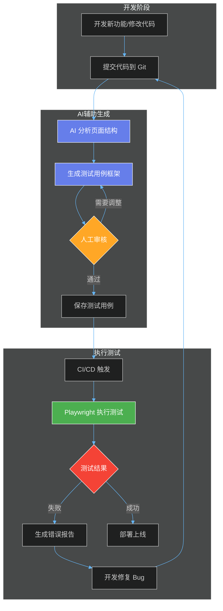
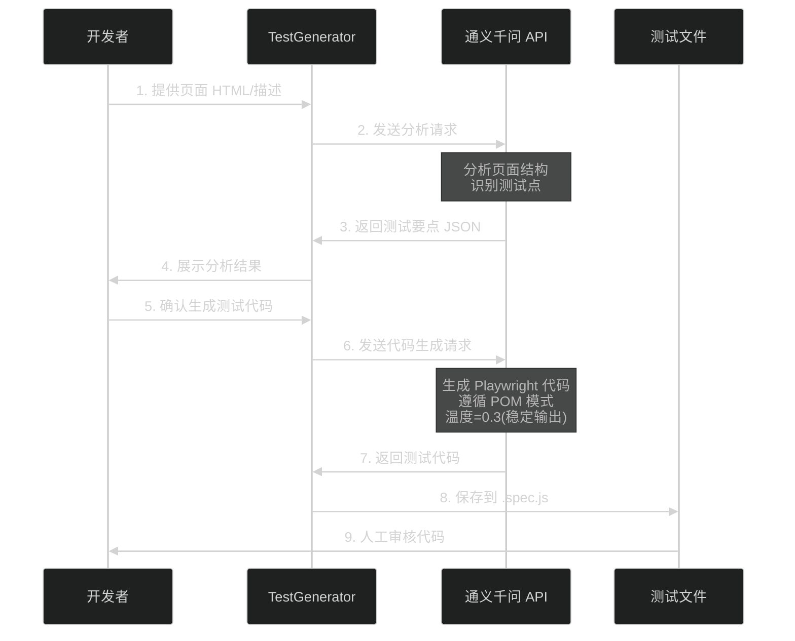
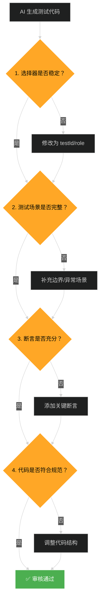

# 🚀 Playwright + 通义千问自动化测试方案

## 背景

项目开发了一年多，大概每周更新一个版本，每次更新都有一堆 bug，特别是一些改动导致的 bug，测试重复性工作较多，开发也在改bug 上花费不少时间，最主要的是线上不稳定，用户投诉反馈缺陷太多，需要提高项目更新质量。

其他项目成员尝试了 devops 集成**Cypress**和**Selenium**方案，效果都不是很佳，主要问题有两个：
1.  **Cypress结合 agent**，自然语言输出的结果每次都不同，不稳定，运行较慢。
2.  用**传统的自动化测试方案**，需要写大量的测试用例，投入产出比可能不成正比。

于是，我准备尝试 **Playwright**+agent 集成 devops 的方案实现自动化测试，使用Playwright进行传统e2e测试，使用MCP 或 agent 生成测试用例，devops 编译完执行测试，这样可以稳定低成本的实现项目的自动化测试。

---

## 📊 方案架构 - 传统测试与智能辅助混合策略



### 核心思路

**关键点：AI 只负责生成，不负责执行**
- ✅ 执行环节用传统方式（Playwright），保证稳定性
- ✅ 生成环节用 AI 辅助，降低编写成本
- ✅ 人工审核把关，确保测试质量

---

## 🎯 两种测试生成方式

本项目提供两种互补的测试生成方案:

### 🔹 方式一: 静态分析生成 (`run_demo.py` + `test_generator.py`)

**适用场景**: 批量分析现有页面,快速生成测试框架

```python
# 扫描 dist 目录中的 HTML 文件
python run_demo.py

# 工作流程:
# 1. 读取 HTML 文件 → 2. AI 分析页面结构 → 3. 生成测试代码
```

**优势**:
- ✅ 简单快速,无需启动浏览器
- ✅ 适合批量处理多个页面
- ✅ 成本低,只需 2-3 次 API 调用

**限制**:
- ⚠️ 只能分析静态 HTML,无法测试动态交互
- ⚠️ 无法获取实时页面状态

---

### 🔹 方式二: MCP 实时交互生成 (`qwen_with_playwright_mcp.py`)

**适用场景**: 复杂 Web 应用,需要真实浏览器交互

```python
# 使用 MCP 集成,AI 实时操作浏览器
python qwen_with_playwright_mcp.py

# 工作流程:
# 1. 启动 Playwright MCP Server
# 2. AI 通过 MCP 工具控制浏览器 (导航、点击、填充等)
# 3. 基于实时反馈生成测试代码
```

**优势**:
- ✅ 真实浏览器环境,能测试复杂交互
- ✅ AI 可以探索页面,自动发现测试点
- ✅ 支持动态内容和 SPA 应用

**特性**:
- 🔧 多轮对话,AI 自主调用浏览器工具
- 🔧 错误处理和超时机制
- 🔧 自动转换 ES6 import 语法

---

### 📊 两种方式对比

| 维度 | 静态分析 (run_demo.py) | MCP 实时交互 (qwen_with_playwright_mcp.py) |
|------|----------------------|----------------------------------------|
| **复杂度** | ⭐ 简单 | ⭐⭐⭐ 中等 |
| **成本** | 💰 低 (2-3次API) | 💰💰 中 (5-15次API + 工具调用) |
| **准确性** | ⭐⭐⭐ 静态结构准确 | ⭐⭐⭐⭐⭐ 动态交互准确 |
| **适用页面** | 静态页面、表单 | 复杂 SPA、动态内容 |
| **速度** | ⚡ 快 (~10秒) | 🐌 较慢 (~30-60秒) |

---

## 🎯 三大核心组件

### 1️⃣ 测试框架 (Playwright)

**为什么选择 Playwright？**

| 特性 | Playwright | Cypress | Selenium |
|------|-----------|---------|----------|
| **跨浏览器支持** | ✅ Chrome/Firefox/Safari/Edge | ⚠️ 主要是 Chrome | ✅ 全支持但配置复杂 |
| **执行速度** | ✅ 快速并行执行 | ⚠️ 较慢 | ❌ 很慢 |
| **API 设计** | ✅ 现代化、易用 | ✅ 简洁 | ❌ 老旧复杂 |
| **网络拦截** | ✅ 原生支持 | ✅ 支持 | ⚠️ 需要额外工具 |
| **自动等待** | ✅ 智能等待 | ✅ 智能等待 | ❌ 需手动 wait |
| **CI/CD 集成** | ✅ 开箱即用 | ✅ 简单 | ⚠️ 配置复杂 |

**本项目使用的 Playwright 最佳实践：**
```javascript
// ✅ 使用 Page Object Model (POM) 设计模式
class LoginPage {
    constructor(page) {
        // ✅ 使用稳定的 testId 选择器
        this.usernameInput = page.getByTestId('username-input');
        this.loginButton = page.getByTestId('login-button');
    }
    
    async login(username, password) {
        // ✅ 自动等待元素可见
        await this.usernameInput.fill(username);
        await this.loginButton.click();
    }
}

// ✅ 测试用例清晰易懂
test('用户登录成功场景', async () => {
    const loginPage = new LoginPage(page);
    await loginPage.login('demo@test.com', 'test123');
    await expect(loginPage.successMessage).toBeVisible();
});
```

---

### 2️⃣ Agent/MCP 用于用例生成和分析

**核心组件：TestGenerator 类**



**工作原理：**

1. **页面分析** (`analyze_page_html`)
   - 输入：HTML 代码
   - AI 提取：可测试元素、操作动作、断言点
   - 输出：结构化 JSON

2. **代码生成** (`generate_test`)
   - 输入：页面描述 + 测试需求
   - AI 生成：完整的 Playwright 测试代码
   - 输出：可直接运行的 `.spec.js` 文件

**关键配置：**
```python
# temperature=0.3 保证输出稳定
response = self.client.chat.completions.create(
    model="qwen-plus-latest",
    temperature=0.3,  # 低温度减少随机性
    messages=[{"role": "user", "content": prompt}]
)
```

**优势对比：**

| 方式 | 生成速度 | 稳定性 | 成本 |
|------|---------|--------|------|
| **通义千问（本方案）** | ⚡ 5-10秒 | ✅ 稳定（低温度） | 💰 0.008元/次 |
| **Cypress+Agent** | 🐌 60秒+ | ❌ 不稳定 | 💰💰 高 |

---

### 3️⃣ 人工审核

**为什么需要人工审核？**
- AI 生成的代码可能存在逻辑错误
- 测试场景可能不完整
- 选择器策略可能需要调整

**审核流程：**



**审核要点：**

✅ **选择器稳定性**
```javascript
// ❌ 不好 - 依赖 class 名称（可能变化）
page.locator('.login-btn')

// ✅ 好 - 使用 testId（稳定）
page.getByTestId('login-button')

// ✅ 好 - 使用语义化 role
page.getByRole('button', { name: '登录' })
```

✅ **测试场景完整性**
- 正向场景：正常流程
- 反向场景：错误输入、边界条件
- 异常场景：网络错误、超时等

✅ **断言充分性**
```javascript
// ❌ 只检查元素可见
await expect(page.getByTestId('success')).toBeVisible();

// ✅ 检查元素可见 + 文本内容
await expect(page.getByTestId('success')).toBeVisible();
await expect(page.getByTestId('success')).toContainText('登录成功');
```

**预期审核时间：5-10 分钟/个页面**

---

## 🚀 快速开始

### 前置条件

- Python 3.8+
- Node.js 16+
- [通义千问 API Key](https://dashscope.aliyun.com/) （新用户有免费额度）

### 安装步骤

```bash
# 1. 克隆/下载项目
cd playwright-qwen-demo

# 2. 安装 Python 依赖
pip install openai

# 3. 设置 API Key （替换成你的）
export DASHSCOPE_API_KEY='sk-your-api-key-here'

# 4. 安装 Node.js 依赖
npm install

# 5. 方式一: 运行基础 Demo (静态分析)
python run_demo.py

# 或 方式二: 运行 MCP 增强版 (实时交互)
python qwen_with_playwright_mcp.py

# 6. 执行生成的测试
npx playwright test tests/generated/markdown_editor.spec.js --headed
```

### 预期输出

**方式一 (run_demo.py) 输出:**
```
============================================================
🤖 Playwright + 通义千问 自动化测试 Demo
============================================================

📂 步骤 1: 扫描 dist 目录中的 HTML 文件...
   ✅ 找到 1 个 HTML 文件:
   1. dist/index.html (123456 bytes)
   📌 将分析: dist/index.html

🔍 步骤 2: 使用 AI 分析页面结构...
   ✅ 分析完成:
   - 发现 15 个可测试元素
   - 建议 8 个测试动作

🎯 步骤 3: 生成 Playwright 测试代码...
   ✅ 测试代码已生成并保存到 generated_test.spec.js
```

**方式二 (qwen_with_playwright_mcp.py) 输出:**
```
============================================================
🎯 Playwright MCP 测试生成器（增强版）
============================================================
2024-11-17 10:30:15 - INFO - 正在启动 Playwright MCP Server...
2024-11-17 10:30:17 - INFO - ✅ MCP Server 启动成功
2024-11-17 10:30:17 - INFO - 🚀 开始生成测试: 测试 Markdown 编辑器的基本功能
2024-11-17 10:30:17 - INFO - 📍 第 1 轮对话
2024-11-17 10:30:18 - INFO - 🔧 AI 请求调用 2 个工具
2024-11-17 10:30:18 - INFO - 🔧 调用工具: browser_navigate({'url': 'http://localhost:3000/'})
2024-11-17 10:30:19 - INFO - ✅ 工具调用成功
2024-11-17 10:30:19 - INFO - 🔧 调用工具: browser_snapshot({})
2024-11-17 10:30:20 - INFO - ✅ 工具调用成功
2024-11-17 10:30:20 - INFO - 📍 第 2 轮对话
2024-11-17 10:30:25 - INFO - ✅ AI 完成测试生成
============================================================
📄 生成的测试代码:
============================================================
import { test, expect } from '@playwright/test';
...
```

---

## 📁 项目结构

```
playwright-qwen-demo/
├── run_demo.py                        # 🎯 基础版: 静态 HTML 分析生成测试
├── qwen_with_playwright_mcp.py        # 🚀 增强版: MCP 实时交互生成测试
├── test_generator.py                  # 🤖 AI 测试生成器核心类
├── config.example.json                # 📝 配置示例
├── config.json                        # 🔑 API Key 配置(需创建)
├── requirements.txt                   # 📦 Python 依赖
├── package.json                       # 📦 Node.js 依赖
├── playwright.config.js               # ⚙️ Playwright 配置
├── dist/                              # 🌐 测试页面目录
│   └── index.html                     # 示例: Markdown 编辑器页面
├── tests/
│   └── generated/
│       └── markdown_editor.spec.js   # ✅ AI 生成的测试代码
└── doc/
    └── DEVELOPMENT.md                 # 📖 详细开发文档
```

---

## 🔗 集成到现有项目

### GitLab CI/CD 示例

```yaml
# .gitlab-ci.yml
stages:
  - generate
  - test
  - deploy

generate-tests:
  stage: generate
  image: python:3.9
  script:
    - pip install openai
    - python scripts/generate_tests.py
  artifacts:
    paths:
      - tests/generated/
  only:
    - merge_requests

run-playwright-tests:
  stage: test
  image: mcr.microsoft.com/playwright:v1.40.0
  needs: ["generate-tests"]
  script:
    - npm ci
    - npx playwright test
  artifacts:
    when: always
    paths:
      - playwright-report/

deploy:
  stage: deploy
  script:
    - echo "部署到生产环境"
  only:
    - main
  when: manual
```

---

## 📚 实际示例

### 示例 1: 生成的测试代码片段

本项目已生成的真实测试代码 (`tests/generated/markdown_editor.spec.js`):

```javascript
import { test, expect } from '@playwright/test';

test.describe('Markdown 编辑器功能测试', () => {
  test.beforeEach(async ({ page }) => {
    await page.goto('http://localhost:3000/');
    await expect(page).toHaveTitle('Markdown 渲染器');
  });

  test('应正确显示初始界面元素', async ({ page }) => {
    // 检查目录区域
    await expect(page.getByRole('heading', { level: 2, name: '目录' })).toBeVisible();
    await expect(page.getByRole('button', { name: '新建文件' })).toBeVisible();
    
    // 检查编辑区域
    const textarea = page.getByRole('textbox', { name: '在这里输入 Markdown 文本...' });
    await expect(textarea).toBeVisible();
    
    // 检查预览区域
    await expect(page.getByRole('heading', { level: 2, name: '渲染预览' })).toBeVisible();
  });

  test('应支持基本的 Markdown 编辑功能', async ({ page }) => {
    const textarea = page.getByRole('textbox');
    await textarea.fill('# 测试标题\n\n这是测试内容');
    
    const preview = page.locator('[data-testid="preview-content"]');
    await expect(preview.getByRole('heading', { level: 1, name: '测试标题' })).toBeVisible();
  });
});
```

**亮点**:
- ✅ 使用 `getByRole`、`getByTestId` 等稳定选择器
- ✅ 包含 `beforeEach` 减少重复代码
- ✅ 断言充分,覆盖可见性和内容
- ✅ 测试用例名称清晰易懂

---

### 示例 2: 测试执行结果

运行测试后的实际输出:

```bash
$ npx playwright test tests/generated/markdown_editor.spec.js

Running 5 tests using 1 worker

  ✓ Markdown 编辑器功能测试 › 应正确显示初始界面元素 (1.2s)
  ✓ Markdown 编辑器功能测试 › 应正确渲染默认的 Markdown 内容 (890ms)
  ✓ Markdown 编辑器功能测试 › 应支持基本的 Markdown 编辑功能 (750ms)
  ✓ Markdown 编辑器功能测试 › 应正确处理图片和引用 (680ms)
  ✓ Markdown 编辑器功能测试 › 应支持表格渲染 (720ms)

  5 passed (4.2s)
```

---

### 示例 3: MCP 工作流程日志

使用 `qwen_with_playwright_mcp.py` 时的详细日志:

```
2024-11-17 10:30:15 - INFO - 正在启动 Playwright MCP Server...
2024-11-17 10:30:17 - INFO - ✅ MCP Server 启动成功
2024-11-17 10:30:17 - INFO - 🚀 开始生成测试: 测试 Markdown 编辑器的基本功能

📍 第 1 轮对话
2024-11-17 10:30:18 - INFO - 🔧 AI 请求调用 2 个工具
2024-11-17 10:30:18 - INFO - 🔧 调用工具: browser_navigate({'url': 'http://localhost:3000/'})
2024-11-17 10:30:19 - INFO - ✅ 工具调用成功
2024-11-17 10:30:19 - INFO - 🔧 调用工具: browser_snapshot({})
2024-11-17 10:30:20 - INFO - ✅ 工具调用成功

📍 第 2 轮对话
2024-11-17 10:30:21 - INFO - 🔧 AI 请求调用 3 个工具
2024-11-17 10:30:21 - INFO - 🔧 调用工具: browser_fill({'selector': 'textarea', 'value': '# 测试'})
2024-11-17 10:30:22 - INFO - ✅ 工具调用成功
2024-11-17 10:30:22 - INFO - 🔧 调用工具: browser_click({'selector': 'button[name="复制"]'})
2024-11-17 10:30:23 - INFO - ✅ 工具调用成功

📍 第 3 轮对话
2024-11-17 10:30:25 - INFO - ✅ AI 完成测试生成
2024-11-17 10:30:25 - INFO - 📝 提取了 markdown 格式的代码
2024-11-17 10:30:25 - INFO - ✨ 已将 require 转换为 import 语法
```

---

## 📚 进阶使用

详细的使用指南、API 文档、集成方案请查看：

👉 **[DEVELOPMENT.md](./doc/DEVELOPMENT.md)**

包含：
- 完整的 API 使用说明 (TestGenerator、PlaywrightMCPClient)
- MCP 集成详解和多轮对话机制
- CI/CD 集成方案 (GitLab、GitHub Actions)
- 故障排除和性能优化
- 常见问题解答

---

## 📄 许可证

MIT License

---

## 🔗 相关链接

- [Playwright 官方文档](https://playwright.dev/)
- [通义千问 API 文档](https://help.aliyun.com/zh/dashscope/)
- [OpenAI Python SDK](https://github.com/openai/openai-python)
