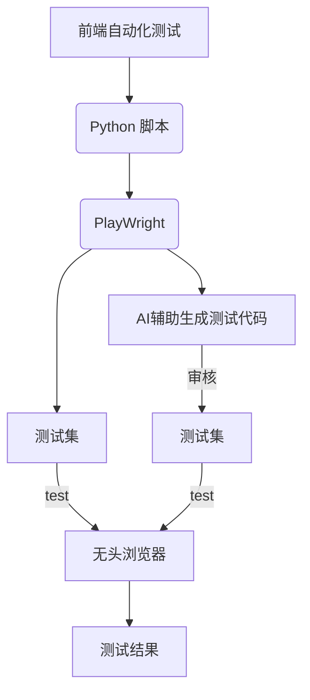
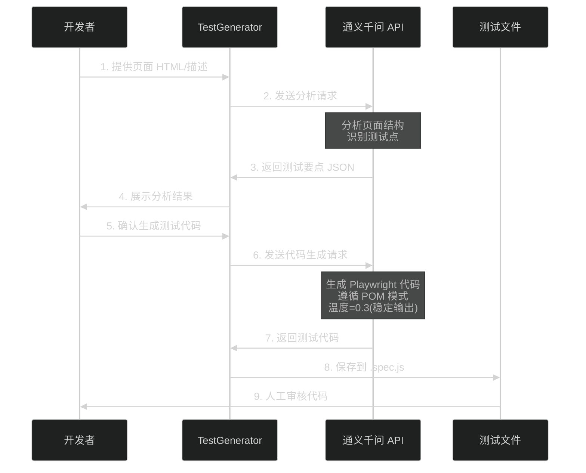
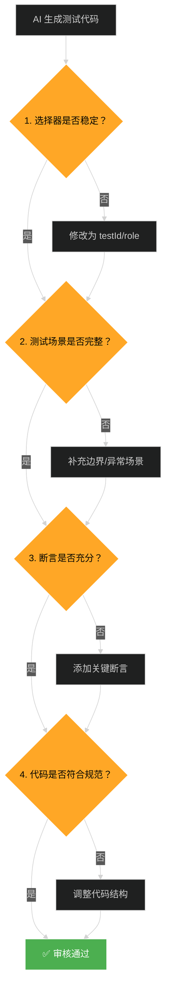

# 🚀 Playwright + 通义千问自动化测试方案

## 背景

项目开发了一年多，大概每周更新一个版本，每次更新都有一堆 bug，特别是一些改动导致的 bug，测试重复性工作较多，开发也在改bug 上花费不少时间，最主要的是线上不稳定，用户投诉反馈缺陷太多，需要提高项目更新质量。

其他项目成员尝试了 devops 集成**Cypress**和**Selenium**方案，效果都不是很佳，主要问题有两个：
1.  **Cypress结合 agent**，自然语言输出的结果每次都不同，不稳定，运行较慢。
2.  用**传统的自动化测试方案**，需要写大量的测试用例，投入产出比可能不成正比。

于是，我准备尝试 **Playwright**+agent 集成 devops 的方案实现自动化测试，使用Playwright进行传统e2e测试，使用MCP 或 agent 生成测试用例，devops 编译完执行测试，这样可以稳定低成本的实现项目的自动化测试。策略如下：



AI 生成 + 人工审核
- AI 生成初始版本
- 人工审核并加固
- 建立测试模板库

## 🚀 快速开始

### 前置条件

- Python 3.8+
- Node.js 16+
- [通义千问 API Key](https://dashscope.aliyun.com/) （新用户有免费额度）

### 安装步骤

```bash
# 1. 克隆/下载项目
cd playwright-qwen-demo

# 2. 安装 Python 依赖
pip install openai

# 3. 设置 API Key （替换成你的）
export DASHSCOPE_API_KEY='sk-your-api-key-here'

# 4. 安装 Node.js 依赖
npm install

python3 qwen_with_playwright_mcp.py

npm run test
```

## 🎯 三大核心组件

### 1️⃣ 测试框架 (Playwright)

**为什么选择 Playwright？**

| 特性 | Playwright | Cypress | Selenium |
|------|-----------|---------|----------|
| **跨浏览器支持** | ✅ Chrome/Firefox/Safari/Edge | ⚠️ 主要是 Chrome | ✅ 全支持但配置复杂 |
| **执行速度** | ✅ 快速并行执行 | ⚠️ 较慢 | ❌ 很慢 |
| **API 设计** | ✅ 现代化、易用 | ✅ 简洁 | ❌ 老旧复杂 |
| **网络拦截** | ✅ 原生支持 | ✅ 支持 | ⚠️ 需要额外工具 |
| **自动等待** | ✅ 智能等待 | ✅ 智能等待 | ❌ 需手动 wait |
| **CI/CD 集成** | ✅ 开箱即用 | ✅ 简单 | ⚠️ 配置复杂 |

**本项目使用的 Playwright 最佳实践：**
```javascript
// ✅ 使用 Page Object Model (POM) 设计模式
class LoginPage {
    constructor(page) {
        // ✅ 使用稳定的 testId 选择器
        this.usernameInput = page.getByTestId('username-input');
        this.loginButton = page.getByTestId('login-button');
    }
    
    async login(username, password) {
        // ✅ 自动等待元素可见
        await this.usernameInput.fill(username);
        await this.loginButton.click();
    }
}

// ✅ 测试用例清晰易懂
test('用户登录成功场景', async () => {
    const loginPage = new LoginPage(page);
    await loginPage.login('demo@test.com', 'test123');
    await expect(loginPage.successMessage).toBeVisible();
});
```

---

### 2️⃣ Agent/MCP 用于用例生成和分析

**核心组件：TestGenerator 类**



**工作原理：**

1. **页面分析** (`analyze_page_html`)
   - 输入：HTML 代码
   - AI 提取：可测试元素、操作动作、断言点
   - 输出：结构化 JSON

2. **代码生成** (`generate_test`)
   - 输入：页面描述 + 测试需求
   - AI 生成：完整的 Playwright 测试代码
   - 输出：可直接运行的 `.spec.js` 文件

**关键配置：**
```python
# temperature=0.3 保证输出稳定
response = self.client.chat.completions.create(
    model="qwen-plus-latest",
    temperature=0.3,  # 低温度减少随机性
    messages=[{"role": "user", "content": prompt}]
)
```

**优势对比：**

| 方式 | 生成速度 | 稳定性 | 成本 |
|------|---------|--------|------|
| **通义千问（本方案）** | ⚡ 5-10秒 | ✅ 稳定（低温度） | 💰 0.008元/次 |
| **Cypress+Agent** | 🐌 60秒+ | ❌ 不稳定 | 💰💰 高 |

---

### 3️⃣ 人工审核

**为什么需要人工审核？**
- AI 生成的代码可能存在逻辑错误
- 测试场景可能不完整
- 选择器策略可能需要调整

**审核流程：**



**审核要点：**

✅ **选择器稳定性**
```javascript
// ❌ 不好 - 依赖 class 名称（可能变化）
page.locator('.login-btn')

// ✅ 好 - 使用 testId（稳定）
page.getByTestId('login-button')

// ✅ 好 - 使用语义化 role
page.getByRole('button', { name: '登录' })
```

✅ **测试场景完整性**
- 正向场景：正常流程
- 反向场景：错误输入、边界条件
- 异常场景：网络错误、超时等

✅ **断言充分性**
```javascript
// ❌ 只检查元素可见
await expect(page.getByTestId('success')).toBeVisible();

// ✅ 检查元素可见 + 文本内容
await expect(page.getByTestId('success')).toBeVisible();
await expect(page.getByTestId('success')).toContainText('登录成功');
```

**预期审核时间：5-10 分钟/个页面**


## 📁 项目结构

```
playwright-qwen-demo/
├── config.py                          # 🔧 统一配置管理（新增）
├── run_demo.py                        # 🎯 基础版: 静态 HTML 分析生成测试
├── qwen_with_playwright_mcp.py        # 🚀 增强版: MCP 实时交互生成测试
├── test_generator.py                  # 🤖 AI 测试生成器核心类（已重构）
├── utils/                             # 🛠️ 工具模块（新增）
│   ├── common.py                      # 公共函数库
│   └── code_validator.py              # 代码验证器
├── tests/
│   ├── templates/                     # 📚 测试模板库（新增）
│   │   ├── basic_test_template.js
│   │   ├── form_test_template.js
│   │   └── navigation_test_template.js
│   └── generated/                     # ✅ AI 生成的测试代码
├── .gitlab-ci.yml                     # 🔄 GitLab CI/CD 配置（新增）
├── .github/workflows/                 # 🔄 GitHub Actions 配置（新增）
│   └── playwright-tests.yml
├── config.example.json                # 📝 配置示例
├── requirements.txt                   # 📦 Python 依赖
├── package.json                       # 📦 Node.js 依赖
├── playwright.config.js               # ⚙️ Playwright 配置
├── dist/                              # 🌐 测试页面目录
└── doc/
    └── DEVELOPMENT.md                 # 📖 详细开发文档
```

---

## 🔗 集成到现有项目

### 快速集成步骤

#### 1️⃣ 复制核心文件到你的项目

```bash
# 复制核心模块
cp config.py your-project/
cp -r utils/ your-project/
cp -r tests/templates/ your-project/tests/

# 复制 CI/CD 配置（根据你使用的平台选择）
cp .gitlab-ci.yml your-project/           # GitLab
cp -r .github/ your-project/              # GitHub
```

#### 2️⃣ 安装依赖

```bash
pip install openai
npm install @playwright/test
```

#### 3️⃣ 配置 API Key

```bash
# 方式1: 环境变量
export DASHSCOPE_API_KEY='your-api-key'

# 方式2: config.json
echo '{"api_key": "your-api-key"}' > config.json
```

#### 4️⃣ 生成测试用例

```python
from test_generator import TestGenerator

generator = TestGenerator()
result = generator.generate_test(
    page_description="你的页面描述",
    scenario="表单提交测试",
    validate=True  # 自动验证代码质量
)

print(f"代码质量评分: {result['validation']['score']}/100")
print(result['code'])
```

### GitLab CI/CD 完整配置

项目已包含完整的 `.gitlab-ci.yml` 配置文件，包含以下阶段：

1. **setup** - 环境准备
2. **generate** - AI 生成测试用例
3. **test** - 多浏览器并行测试
4. **report** - 生成测试报告
5. **deploy** - 部署到生产/预发布

```bash
# 使用方式：直接提交代码即可自动运行
git add .
git commit -m "feat: 添加自动化测试"
git push origin main
```

### GitHub Actions 完整配置

项目已包含 `.github/workflows/playwright-tests.yml` 配置文件，支持：

- 定时运行（每天早上8点）
- Pull Request 自动测试
- 手动触发

```bash
# 查看运行状态
# 访问: https://github.com/your-repo/actions
```

### 自定义配置

编辑 `config.py` 调整参数：

```python
class Config:
    # AI 模型配置
    AI_MODEL = "qwen-plus-latest"
    AI_TEMPERATURE_STABLE = 0.1  # 更低=更稳定
    
    # MCP 配置
    MCP_MAX_ITERATIONS = 15
    MCP_TIMEOUT = 30
    
    # 本地服务器配置
    LOCAL_SERVER_PORT_RANGE = (8000, 9000)
```

---

## ❓ 常见问题

### Q1: 为什么生成的代码质量评分低？

**A:** 可能原因：
1. 页面描述不够详细 → 提供更完整的页面结构和交互说明
2. 温度设置过高 → 检查 `config.py` 中的 `AI_TEMPERATURE_STABLE`（应为 0.1）
3. 未使用模板 → 确保 `TestGenerator(use_templates=True)`

### Q2: CI/CD 中 AI 生成失败怎么办？

**A:** 解决方案：
1. 检查 API Key 是否正确配置在 CI 环境变量中
2. 启用重试机制（已在 `.gitlab-ci.yml` 中配置 `retry: 2`）
3. 设置 `allow_failure: true` 允许 AI 生成失败但不阻塞测试

### Q3: 如何提高生成速度？

**A:** 优化建议：
1. 使用缓存机制（相同输入返回缓存结果）
2. 减少模板长度（只保留核心示例）
3. 降低 `max_retries` 参数

### Q4: 生成的选择器不稳定怎么办？

**A:** 改进方法：
1. 在 HTML 中添加 `data-testid` 属性
2. 使用语义化的 `role` 和 `aria-label`
3. 代码验证器会自动提示不稳定选择器，人工审核时修正

### Q5: 修改了 HTML 但生成的测试还是用旧版本？

**A:** 已修复！v2.0.1 版本后，本地服务器会自动禁用浏览器缓存：
- 服务器响应头包含 `Cache-Control: no-store`
- 每次都会加载最新的文件
- 无需手动清除浏览器缓存

如果仍有问题，可以：
1. 重启生成脚本（退出并重新运行）
2. 检查是否修改了正确的文件路径
3. 确认 `config.DIST_DIR` 指向正确的目录

---

## 🤝 贡献指南

欢迎提交 Issue 和 Pull Request！

改进建议方向：
1. 新增更多测试模板（如登录、注册、支付等）
2. 支持更多 AI 模型（OpenAI GPT-4、Claude 等）
3. 增强代码验证规则
4. 优化提示词工程

---

## 📄 许可证

MIT License

---

## 🔗 相关链接

- [Playwright 官方文档](https://playwright.dev/)
- [通义千问 API 文档](https://help.aliyun.com/zh/dashscope/)
- [OpenAI Python SDK](https://github.com/openai/openai-python)
- [GitLab CI/CD 文档](https://docs.gitlab.com/ee/ci/)
- [GitHub Actions 文档](https://docs.github.com/actions)

---
