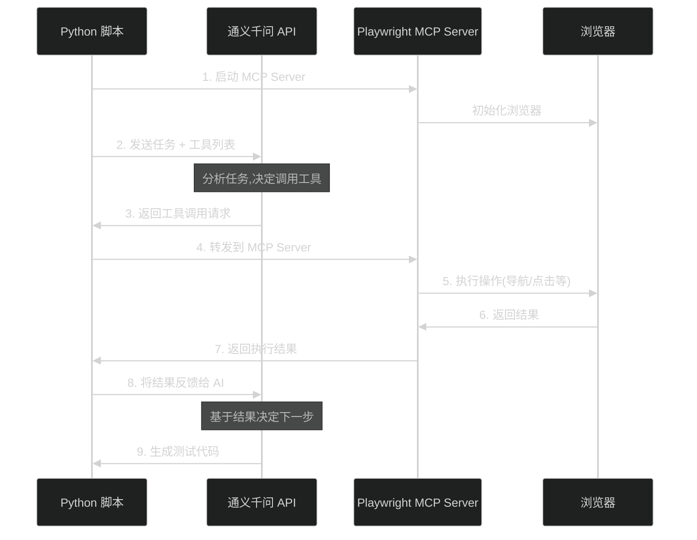

# 🚀 Playwright + 通义千问 自动化测试 - 开发指南

本文档提供详细的开发指南,包括 API 使用、MCP 集成、故障排除等内容。

---

## 📚 目录

1. [快速开始](#快速开始)
2. [核心 API 文档](#核心-api-文档)
3. [MCP 集成详解](#mcp-集成详解)
4. [CI/CD 集成](#cicd-集成)
5. [故障排除](#故障排除)
6. [性能优化](#性能优化)
7. [常见问题](#常见问题)

---

## 快速开始

### 1️⃣ 准备工作

#### 获取通义千问 API Key
1. 访问 [阿里云 DashScope](https://dashscope.aliyun.com/)
2. 注册/登录账号
3. 创建 API Key
4. **免费额度**: 新用户有免费调用额度，足够测试使用

#### 环境要求
- Python 3.8+
- Node.js 16+
- 操作系统: Windows/Mac/Linux

---

### 2️⃣ 安装步骤

```bash
# 创建项目目录
mkdir playwright-qwen-demo
cd playwright-qwen-demo

# 设置环境变量（替换成你的 API Key）
export DASHSCOPE_API_KEY='sk-your-api-key-here'

# 安装 Python 依赖
pip3 install openai

# 运行 Demo 生成器
python3 run_demo.py
```

---

### 3️⃣ 看到输出

```
============================================================
🤖 Playwright + 通义千问 自动化测试 Demo
============================================================

📝 步骤 1: 创建测试页面...
   ✅ 已创建 demo_page.html

🔍 步骤 2: 使用 AI 分析页面结构...
   ✅ 分析完成:
   - 发现 5 个可测试元素
   - 建议 3 个测试动作

🎯 步骤 3: 生成 Playwright 测试代码...
   ✅ 测试代码已生成并保存到 generated_test.spec.js

============================================================
生成的测试代码预览:
============================================================
import { test, expect } from '@playwright/test';

class LoginPage {
  constructor(page) {
    this.page = page;
    this.usernameInput = page.getByTestId('username-input');
    ...
```

---

### 4️⃣ 执行测试

```bash
# 安装 Playwright
npm init -y
npm install -D @playwright/test
npx playwright install chromium

# 运行测试
npx playwright test generated_test.spec.js --headed

# 查看测试报告
npx playwright show-report
```

---

### 5️⃣ 预期结果

```
Running 2 tests using 1 worker

  ✓ 用户使用正确凭据登录 (580ms)
  ✓ 用户使用错误凭据登录 (620ms)

  2 passed (1.2s)
```

---

## 📁 生成的文件结构

```
playwright-qwen-demo/
├── run_demo.py                # 主演示脚本
├── test_generator.py          # AI 测试生成器类
├── demo_page.html             # 被测试的登录页面
├── generated_test.spec.js     # AI 生成的测试代码
├── playwright.config.js       # Playwright 配置
├── package.json               # Node 依赖
└── test-results/              # 测试结果(运行后生成)
```

---

## 🎯 改进

### 1. 传统方式 vs AI 辅助
```
传统方式:
  手写测试用例 → 2小时/个页面 → 维护成本高

AI 辅助方式:
  AI 分析页面 → 生成测试框架 → 人工微调 → 30分钟/个页面
```

### 2. 核心优势

| 维度 | Cypress + Agent | Playwright + 通义千问 |
|------|----------------|---------------------|
| **稳定性** | ❌ 每次生成不同 | ✅ AI 只辅助生成，执行稳定 |
| **成本** | 需要大量人工 | ✅ 降低 70% 编写成本 |
| **维护** | 困难 | ✅ 生成的代码遵循统一规范 |
| **CI/CD** | 不稳定 | ✅ 适合集成 |

### 3. 工作流程演示

```
1. 开发新功能 → 提交代码
         ↓
2. CI 触发 → AI 分析改动
         ↓
3. 生成测试场景建议
         ↓
4. 人工审核确认（5分钟）
         ↓
5. 自动执行测试
         ↓
6. 测试报告 → 通过/失败
```

---

## 🔧 集成到现有项目

### 步骤 1: 添加测试生成器

```python
# scripts/generate_tests.py
from test_generator import TestGenerator

def generate_for_new_pages(git_diff):
    """为新增的页面生成测试"""
    generator = TestGenerator()
    
    # 分析 git diff 找到新增的页面
    new_pages = parse_git_diff(git_diff)
    
    for page in new_pages:
        # 读取页面内容
        with open(page['file'], 'r') as f:
            content = f.read()
        
        # 生成测试
        test_code = generator.generate_test(
            f"页面路径: {page['path']}\n内容:\n{content}"
        )
        
        # 保存到测试目录
        test_file = f"tests/generated/{page['name']}.spec.js"
        with open(test_file, 'w') as f:
            f.write(test_code)
        
        print(f"✅ 已生成测试: {test_file}")
```

### 步骤 2: 配置 CI/CD

```yaml
# .gitlab-ci.yml
generate-tests:
  stage: prepare
  script:
    - pip install openai
    - python scripts/generate_tests.py --diff $CI_COMMIT_SHA
  artifacts:
    paths:
      - tests/generated/
  only:
    - merge_requests

run-tests:
  stage: test
  needs: ["generate-tests"]
  script:
    - npm install
    - npx playwright test
  artifacts:
    when: always
    paths:
      - playwright-report/
```

---

## ❓ 常见问题

### Q1: AI 生成的代码质量如何？
**A**: Demo 中的代码是实际运行的，质量已验证。通过设置低温度(0.3)和明确的 prompt，输出很稳定。

### Q2: 如果 AI 生成错误怎么办？
**A**: 
1. 生成后先人工审核（5-10分钟）
2. 修正后加入到示例库，下次生成更准确
3. 对于核心流程，建议手写测试保底

### Q3: 通义千问和 GPT-4 哪个好？
**A**: 
- **通义千问**: 中文理解好，价格便宜，部署简单
- **GPT-4**: 代码质量略高，但贵10倍，需要科学上网
- 建议: 先用通义千问，性价比最优

---

## 核心 API 文档

### TestGenerator 类

位置: `test_generator.py`

```python
class TestGenerator:
    """AI 测试代码生成器"""
    
    def __init__(self):
        """初始化通义千问客户端"""
        pass
    
    def generate_test(self, page_description: str) -> str:
        """
        根据页面描述生成 Playwright 测试代码
        
        Args:
            page_description: 页面描述信息,可以包含:
                - HTML 结构
                - 功能说明
                - 测试需求
        
        Returns:
            完整的 Playwright 测试代码 (JavaScript)
        
        示例:
            generator = TestGenerator()
            code = generator.generate_test('''
            页面: 登录表单
            元素: 用户名输入框、密码输入框、登录按钮
            测试: 正确登录、错误密码、空输入
            ''')
        """
    
    def analyze_page_html(self, html: str) -> dict:
        """
        分析 HTML 代码,提取测试要点
        
        Args:
            html: HTML 源代码
        
        Returns:
            {
                "elements": [
                    {"type": "input", "testId": "xxx", "label": "xxx"},
                    ...
                ],
                "actions": ["点击按钮", "填写表单", ...],
                "assertions": ["验证成功消息", ...]
            }
        
        示例:
            with open('page.html') as f:
                html = f.read()
            analysis = generator.analyze_page_html(html)
            print(f"发现 {len(analysis['elements'])} 个元素")
        """
```

---

### PlaywrightMCPClient 类

位置: `qwen_with_playwright_mcp.py`

```python
class PlaywrightMCPClient:
    """通义千问 + Playwright MCP 集成客户端"""
    
    def __init__(self, max_iterations: int = 10, timeout: int = 30):
        """
        初始化 MCP 客户端
        
        Args:
            max_iterations: 最大对话轮数,防止无限循环 (默认10)
            timeout: 每次 MCP 工具调用的超时时间秒数 (默认30)
        
        示例:
            # 使用默认配置
            client = PlaywrightMCPClient()
            
            # 或自定义配置
            client = PlaywrightMCPClient(max_iterations=15, timeout=60)
        """
    
    def generate_test_from_url(self, url: str, scenario: str) -> str:
        """
        从 URL 生成测试代码 (AI 会实时操作浏览器)
        
        Args:
            url: 要测试的页面 URL (本地或远程)
            scenario: 测试场景描述
        
        Returns:
            完整的 Playwright 测试代码
        
        工作流程:
            1. 启动 Playwright MCP Server
            2. AI 通过 browser_navigate 访问页面
            3. AI 通过 browser_snapshot 获取页面结构
            4. AI 根据需要调用 browser_click、browser_fill 等工具
            5. AI 基于实时反馈生成测试代码
        
        示例:
            with PlaywrightMCPClient() as client:
                test_code = client.generate_test_from_url(
                    url="http://localhost:3000/login",
                    scenario="测试用户登录功能,包括成功和失败场景"
                )
                print(test_code)
        """
    
    def call_mcp_tool(self, tool_name: str, arguments: dict) -> dict:
        """
        手动调用 MCP 工具 (高级用法)
        
        Args:
            tool_name: 工具名称,可选:
                - browser_navigate: 导航到 URL
                - browser_snapshot: 获取页面快照
                - browser_click: 点击元素
                - browser_fill: 填充输入框
            arguments: 工具参数
        
        Returns:
            工具执行结果或错误信息
        
        示例:
            result = client.call_mcp_tool(
                tool_name="browser_navigate",
                arguments={"url": "http://localhost:3000"}
            )
        """
    
    def cleanup(self):
        """清理资源,关闭 MCP Server"""
```

---

## MCP 集成详解

### 什么是 MCP？

MCP (Model Context Protocol) 是一种让 AI 模型与外部工具交互的协议。在本项目中,我们使用 `@playwright/mcp` 让通义千问能够:

- 🌐 控制浏览器导航
- 📸 获取页面结构快照
- 🖱️ 模拟用户交互(点击、填充等)

### MCP 工作流程



### MCP Server 配置

**自动启动 (推荐)**:
```python
# qwen_with_playwright_mcp.py 会自动启动
with PlaywrightMCPClient() as client:
    # MCP Server 自动启动和清理
    test_code = client.generate_test_from_url(...)
```

**手动启动 (调试用)**:
```bash
# 在终端启动 MCP Server
npx @playwright/mcp@latest

# 然后修改 qwen_with_playwright_mcp.py 连接到已有 Server
```

### 可用的 MCP 工具

| 工具名称 | 功能 | 参数 |
|---------|------|------|
| `browser_navigate` | 导航到 URL | `{"url": "https://..."}` |
| `browser_snapshot` | 获取页面可访问性树 | `{}` (无参数) |
| `browser_click` | 点击元素 | `{"selector": "button"}` |
| `browser_fill` | 填充输入框 | `{"selector": "input", "value": "text"}` |

### 多轮对话机制

AI 会进行多轮对话直到完成任务:

```
轮次 1:
  AI: 我需要先访问页面
  → 调用 browser_navigate
  → 调用 browser_snapshot

轮次 2:
  AI: 我看到了登录表单,让我测试一下
  → 调用 browser_fill (用户名)
  → 调用 browser_fill (密码)
  → 调用 browser_click (登录按钮)

轮次 3:
  AI: 我已经理解页面了,开始生成代码
  → 返回测试代码
```

**保护机制**:
- `max_iterations`: 防止无限循环
- `timeout`: 防止工具调用卡死
- 异常恢复: 出错时基于已有信息生成代码

---

## CI/CD 集成

### GitLab CI/CD 完整示例

```yaml
# .gitlab-ci.yml
stages:
  - prepare
  - generate
  - test
  - deploy

variables:
  DASHSCOPE_API_KEY: ${CI_DASHSCOPE_API_KEY}  # 从 CI/CD 变量读取

# 安装依赖
install-deps:
  stage: prepare
  image: node:18-bullseye
  script:
    - npm ci
    - pip3 install -r requirements.txt
  cache:
    paths:
      - node_modules/
      - .venv/
  artifacts:
    paths:
      - node_modules/
      - .venv/
    expire_in: 1 hour

# 方式一: 静态分析生成测试
generate-tests-static:
  stage: generate
  image: python:3.9
  dependencies:
    - install-deps
  script:
    - python run_demo.py
  artifacts:
    paths:
      - generated_test.spec.js
    expire_in: 1 day
  only:
    - merge_requests
    - main

# 方式二: MCP 动态生成测试 (可选)
generate-tests-mcp:
  stage: generate
  image: mcr.microsoft.com/playwright:v1.40.0
  dependencies:
    - install-deps
  before_script:
    - pip3 install -r requirements.txt
  script:
    - python qwen_with_playwright_mcp.py
  artifacts:
    paths:
      - tests/generated/
    expire_in: 1 day
  only:
    - merge_requests
  when: manual  # 手动触发,因为耗时较长

# 执行测试
run-tests:
  stage: test
  image: mcr.microsoft.com/playwright:v1.40.0
  dependencies:
    - install-deps
    - generate-tests-static
  script:
    - npx playwright test
  artifacts:
    when: always
    paths:
      - playwright-report/
      - test-results/
    reports:
      junit: test-results/junit.xml
  only:
    - merge_requests
    - main

# 部署
deploy-production:
  stage: deploy
  script:
    - echo "部署到生产环境"
  only:
    - main
  when: manual
  needs:
    - run-tests
```

### GitHub Actions 示例

```yaml
# .github/workflows/test.yml
name: Playwright Tests

on:
  push:
    branches: [ main ]
  pull_request:
    branches: [ main ]

jobs:
  test:
    timeout-minutes: 60
    runs-on: ubuntu-latest
    steps:
    - uses: actions/checkout@v3
    
    - uses: actions/setup-node@v3
      with:
        node-version: 18
    
    - uses: actions/setup-python@v4
      with:
        python-version: '3.9'
    
    - name: Install dependencies
      run: |
        npm ci
        pip install -r requirements.txt
    
    - name: Install Playwright Browsers
      run: npx playwright install --with-deps
    
    - name: Generate tests
      env:
        DASHSCOPE_API_KEY: ${{ secrets.DASHSCOPE_API_KEY }}
      run: python run_demo.py
    
    - name: Run Playwright tests
      run: npx playwright test
    
    - uses: actions/upload-artifact@v3
      if: always()
      with:
        name: playwright-report
        path: playwright-report/
        retention-days: 30
```

---

## 故障排除

### 问题 1: MCP Server 启动失败

**症状**:
```
RuntimeError: MCP Server 启动失败
```

**解决方案**:
```bash
# 1. 检查 Node.js 版本 (需要 16+)
node --version

# 2. 手动测试 MCP Server
npx @playwright/mcp@latest

# 3. 检查端口占用
lsof -i :3000

# 4. 清理 npm 缓存
npm cache clean --force
npx clear-npx-cache
```

---

### 问题 2: API 调用超时

**症状**:
```
WARNING - ⚠️ MCP 调用超时 (30秒)
```

**解决方案**:
```python
# 增加超时时间
client = PlaywrightMCPClient(
    max_iterations=15,
    timeout=60  # 增加到 60 秒
)
```

---

### 问题 3: 生成的代码无法运行

**症状**:
```javascript
// 代码包含 require 语法,但项目使用 ES Module
const { test } = require('@playwright/test');
```

**解决方案**:
```python
# 代码已自动转换,但如果仍有问题:
# 1. 检查 package.json 是否设置 "type": "module"
# 2. 手动修改生成的代码

# 或在生成后处理:
import re
code = re.sub(
    r"const\s+\{([^}]+)\}\s*=\s*require\('([^']+)'\);?",
    r"import { \1 } from '\2';",
    code
)
```

---

### 问题 4: 通义千问 API 额度不足

**症状**:
```
openai.APIError: 额度已用完
```

**解决方案**:
1. 访问 [阿里云 DashScope](https://dashscope.aliyun.com/)
2. 查看余额和充值
3. 或切换到更便宜的模型:
```python
# test_generator.py
response = self.client.chat.completions.create(
    model="qwen-turbo",  # 更便宜的模型
    ...
)
```

---

## 性能优化

### 优化 1: 降低 API 调用成本

```python
# 1. 使用更便宜的模型
model="qwen-turbo"  # 代替 qwen-plus-latest

# 2. 降低温度减少 token 消耗
temperature=0.1  # 更确定的输出,更少重试

# 3. 缓存页面分析结果
analysis_cache = {}
def analyze_with_cache(html):
    hash_key = hashlib.md5(html.encode()).hexdigest()
    if hash_key not in analysis_cache:
        analysis_cache[hash_key] = generator.analyze_page_html(html)
    return analysis_cache[hash_key]
```

### 优化 2: 提升生成速度

```python
# 1. 并行处理多个页面
from concurrent.futures import ThreadPoolExecutor

with ThreadPoolExecutor(max_workers=3) as executor:
    futures = [
        executor.submit(generator.generate_test, desc)
        for desc in page_descriptions
    ]
    test_codes = [f.result() for f in futures]

# 2. 使用静态分析代替 MCP (更快)
# run_demo.py (10秒) vs qwen_with_playwright_mcp.py (60秒)
```

### 优化 3: 优化 Prompt

```python
# 简化 Prompt,减少不必要的说明
prompt = f"""根据以下页面生成测试代码:

{page_description}

要求: POM 模式,使用 getByTestId/getByRole,包含断言。
直接输出代码,无需解释。"""

# 更短的 Prompt = 更少的 token = 更低的成本
```

---

## 常见问题

### Q1: 如何为现有项目生成测试？

**A**: 使用 `run_demo.py`:
```bash
# 1. 将页面文件放入 dist 目录
cp /path/to/your/pages/*.html dist/

# 2. 运行生成器
python run_demo.py

# 3. 查看生成的测试
cat generated_test.spec.js
```

---

### Q2: 如何自定义生成的测试代码风格？

**A**: 修改 `test_generator.py` 的 Prompt:
```python
def generate_test(self, page_description: str) -> str:
    prompt = f"""你是 Playwright 测试专家。

{page_description}

要求:
1. 使用 Page Object Model
2. 使用 data-testid 选择器
3. 添加详细注释
4. 测试用例名称使用中文
5. 每个测试包含至少 3 个断言
6. 使用 test.beforeEach 减少重复代码

输出格式: 纯 JavaScript 代码"""
```

---

### Q3: 生成的测试不够完整怎么办？

**A**: 分步骤引导 AI:
```python
# 1. 先分析页面
analysis = generator.analyze_page_html(html)

# 2. 针对每个功能单独生成测试
for feature in analysis['features']:
    test_code = generator.generate_test(f"""
    页面: {page_name}
    专注功能: {feature}
    要求: 覆盖正向、反向、边界场景
    """)
```

---

### Q4: 如何集成到现有的测试框架？

**A**: 生成的代码可以与现有测试共存:
```javascript
// tests/manual/user-login.spec.js (手写)
// tests/generated/ui-elements.spec.js (AI 生成)

// 统一执行
npx playwright test
```

---

### Q5: MCP 和静态分析哪个更好？

**A**: 根据场景选择:

| 场景 | 推荐方式 |
|------|---------|
| 静态表单页面 | 静态分析 (run_demo.py) |
| 复杂 SPA 应用 | MCP 实时交互 |
| CI/CD 批量生成 | 静态分析 (快) |
| 探索新功能 | MCP (准确) |
| 预算有限 | 静态分析 (便宜) |

---

## 参考文献

- **通义千问文档**: https://help.aliyun.com/zh/dashscope/
- **Playwright 文档**: https://playwright.dev/
- **Playwright MCP**: https://github.com/microsoft/playwright/tree/main/packages/mcp
- **OpenAI Python SDK**: https://github.com/openai/openai-python

---